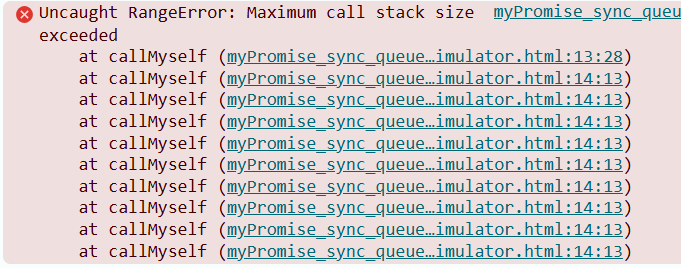

# If Js can do only thing at a time, how does it appear to do many things?

# Topic will be covered:
- Call Stack 


## Call Stack 
- It keeps track of function call in the order they are executed.
- It helps determine which function currently running and what runs next.
```js
    function f1() {
        console.log('Hi by f1!');
    }

    function f2() {
        f1();
        console.log('Hi by f2!');
    }
    console.log("hello Shahruk");
    f2();

        Time →  |  Stack Growth & Shrinkage
    ━━━━━━━━━━━━━━━━━━━━━━━━━━━━━━━━━━━━━━━━━━━━━━━━━━
    Step 1  |  [Global]
            |
    Step 2  |  [Global]  ← console.log("hello Shahruk")
            |
    Step 3  |  [Global, f2]  ← f2() called
            |       ↑
    Step 4  |  [Global, f2, f1]  ← f1() called
            |            ↑
    Step 5  |  [Global, f2, f1]  ← console.log("Hi by f1!")
            |
    Step 6  |  [Global, f2]  ← f1() returns (popped)
            |
    Step 7  |  [Global, f2]  ← console.log("Hi by f2!")
            |
    Step 8  |  [Global]  ← f2() returns (popped)
            |
    Step 9  |  []  ← Global done
━━━━━━━━━━━━━━━━━━━━━━━━━━━━━━━━━━━━━━━━━━━━━━━━━━

```

### Stack Overflow
- Commonly caused by infinite or uncontrolled recursion.
- Also occur when too many function calls are made without returning.

```js
   function callMyself(){
      callMyself();
    }

    callMyself();
```


